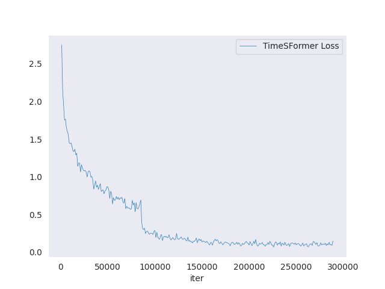
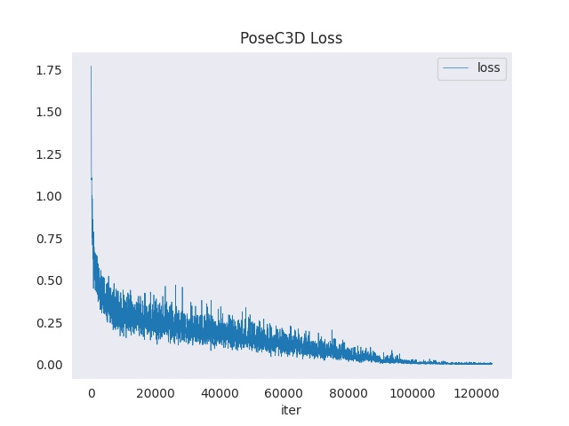

# P-HAR: Porn Human Action Recognition

This is just a fun, side-project to see how State-of-the-art (SOTA) Human Action Recognition (HAR) models fare in the pornographic domain. HAR is a relatively new, active field of research in the deep learning domain, its goal being the identification of human actions from various input streams (e.g. video or sensor).

The pornography domain is interesting from a technical perspective because of its inherent difficulties. Light variations, occlusions, and a tremendous variations of different camera angles and filming techniques (POV, dedicated camera person) make position (action) recognition hard. We can have two identical positions (actions) and yet be captured in such a different camera perspective to entirely confuse the model in its predictions.

This repository uses three different input streams in order to get the best possible results: rgb frames, human skeleton, and audio. Correspondingly three different models are trained on these input streams and their results are merged through late fusion.

The best current accuracy reached by this multi-model model currently is **75.64%**, which is promising considering the small [training set](#dataset). This result will be improved in the future.

The models work on spatio-temporal data, meaning that they processes video clips rather than single images ([miles-deep](https://github.com/ryanjay0/miles-deep) is using single images for example). This is an inherently superior way of performing action recognition.

Currently, 17 actions are supported. You can find the complete list [here](resources/annotations/annotations.txt). More data would be needed to further improve the models (help is welcomed). Read on for more information!

## Supported Features

First download the human detector [here](http://download.openmmlab.com/mmdetection/v2.0/faster_rcnn/faster_rcnn_r50_fpn_2x_coco/faster_rcnn_r50_fpn_2x_coco_bbox_mAP-0.384_20200504_210434-a5d8aa15.pth), pose model [here](https://download.openmmlab.com/mmpose/top_down/hrnet/hrnet_w32_coco_256x192-c78dce93_20200708.pth), and HAR models [here](https://github.com/rlleshi/phar/releases/tag/v1.0.0). Then move them inside the `checkpoints/har` folder.

Or just use a docker container from the [image](#docker).

### Video Demo

Input a video and get a demo with the top predictions every 7 seconds by default.

`python src/demo/multimodial_demo.py video.mp4 demo.mp4`

Alternatively, the results can also be dumped in a json file by specifying the output file as such.

If you only want to use the RGB & Skeleton model, then you can disable the audio model like so:

`python src/demo/multimodial_demo.py video.mp4 demo.json --audio-checkpoint '' --coefficients 0.5 1.0 --verbose`

Check out the [detailed usage](#multimodial-demo).

### Timestamp Generator

Use the flag `--timestamps`

`python src/demo/multimodial_demo.py video.mp4 demo.json --timestamps`

### Tag Generator

Given the predictions generated by the multimodial demo (in json), we can grab the top 3 tags (by default) like so:

`python src/top_tags.py demo.json`

Checkout the [detailed usage](#late-fusion).

### Content Filtering

TODO: depending if people need it.

### Deployment

Depends if people find this project useful. Currently one has to install the relevant libraries to use these models. See the installation section below.

## Motivation & Usages

The idea behind this project is to try and apply the latest deep learning techniques (i.e. [human action recognition](https://scholar.google.com/scholar?hl=en&as_sdt=0%2C5&q=human+action+recognition&btnG=)) in the pornographic domain.

Once we have detailed information about the kind of actions/positions that are happening in a video a number of uses-cases can apply:

1. Improving the recommender system
2. Automatic tag generator
3. Automatic timestamp generator (when does an action start and finish)
4. Cutting content out (for example non-sexual content)

## Installation

### Docker

Build the docker image: `docker build -f docker/Dockerfile . -t rlleshi/phar`

### Manual Installation

This project is based on [MMAction2](https://github.com/open-mmlab/mmaction2).

The following installation instructions are for ubuntu (hence should also work for Windows WSL). Check the links for details if you are interested in other operating systems.

0. Clone this repo and its submodules: `git clone --recurse-submodules git@github.com:rlleshi/phar.git` and then create and environment with python 3.8+.
1. Install torch (of course, it is recommended that you have CUDA & CUDNN installed).
2. Install the correct version of `mmcv` based on your CUDA & Torch, e.g. `pip install mmcv-full==1.3.18 -f https://download.openmmlab.com/mmcv/dist/cu113/torch1.10.0/index.html`
3. Install mmaction:2 `cd mmaction2/ && pip install cython --no-cache-dir && pip install --no-cache-dir -e .`
4. Install MMPose, [link](https://mmpose.readthedocs.io/en/latest/install.html).
5. Install MMDetection, [link](https://mmdetection.readthedocs.io/en/latest/get_started.html#installation).
6. Install extra dependencies: `pip install -r requirements/extra.txt`.

## Models

The SOTA results are archieved by late-fusing three models based on three input streams. This results in significant improvements compared to only using an RGB-based model. Since more than one action might happen at the same time (and moreover, currently, some of the actions/positions have are conceptually overlapping), it is best to consider the top 2 accuracy as a performance measurement. Hence, currently the multimodial model has a `~75%` accuracy. However, since the dataset is quite small and in total only ~50 experiments have been performed, there is a lot of room for improvement.

### Multi-Modial (Rgb + Skeleton + Audio)

The best performing models (performance & runtime wise) are `timesformer` for the RGB stream, `poseC3D` for the skeleton stream, and `resnet101` for the Audio stream. The results of these models are fused together through late fusion. The models do not have the same importance in the late fusion scoring scheme. Currently the fine-tuned weights are: `0.5; 0.6; 1.0` for the RGB, skeleton & audio model respectively.

Another approach would be to train a model with two of the input streams at a time (i.e. rgb+skeleton & rgb+audio) and then perhaps combine their results. But this wouldn't work due to the nature of the data. When it comes to the audio input streams, it can only be exploited for certain actions (e.g. `deepthroat` due to the gag reflex or `anal` due to a higher pitch), while for others it's not possible to derive any insight from their audio (e.g. missionary, doggy and cowgirl do not have any special characteristics to set them apart from an audio perspective).

Likewise, the skeleton-based model can only be used in those instances where the pose estimation is accurate above a certain confidence threshold (for these experiments the threshold used was 0.4). For example, for actions such as `scoop-up` or `the-snake` it's hard to get an accurate pose estimation in most camera angles due to the proximity of the human bodies in the frame (the poses get fuzzy and mixed up). This then influences the accuracy of the HAR model negatively. However, for actions such as doggy, cowgirl or missionary, the pose estimation is generally good enough to train a HAR model.

However, if we have a bigger dataset, then we will probably have enough instances of clean samples for the difficult actions such as to train all (17) of them with a skeleton-based model. Skeleton based models are according to the current SOTA literature superior to the rgb-based ones. Ideally of course, the pose estimation models should also be fine tuned in the sex domain in order to get a better overall pose estimation.

#### Metrics

Accuracy | Weights
--- | ---
Top 1 Accuracy: 0.6362 <br> Top 2 Accuracy: 0.7524 <br> Top 3 Accuracy: 0.8155 <br> Top 4 Accuracy: 0.8521 <br> Top 5 Accuracy: 0.8771 | Rgb: 0.5 <br> Skeleton: 0.6 <br> Audio: 1.0

### RGB model - [TimeSformer](https://arxiv.org/abs/2102.05095)

The best results for a 3D RGB model are achieved by the attention-based TimeSformer architecture. This model is also very fast in inference (~0.53s / 7s clips).

#### Metrics

Accuracy | Training Speed | Complexity
--- | --- | ---
top1_acc 0.5669 <br> top2_acc 0.6834 <br> top3_acc 0.7632 <br> top4_acc 0.8096 <br> top5_acc 0.8411 | Avg iter time: 0.3472 s/iter | Flops: 100.96 GFLOPs <br> Params: 121.27 M

#### Loss



#### Classes

All 17 annotations. See [annotations](resources/annotations/annotations.txt).

### Skeleton model - [PoseC3D](https://arxiv.org/abs/2104.13586)

The best results for a skeleton-based model are achieved by the CNN-based PoseC3D architecture. This model is also fast in inference (~3.3s / 7s clips).

#### Metrics

Accuracy | Training Speed | Complexity
--- | --- | ---
top1_acc 0.8130 <br> top2_acc 0.9191 <br> top3_acc 0.9748 | Avg iter time: 0.8616 s/iter| Flops: 17.83 GFLOPs <br> Params: 2.0 M

Check the [confusion matrix](resources/metrics/skeleton_cm.png) for a detailed overview of the performance.

#### Loss



#### Classes

6 annotations. See [annotations](resources/annotations/annotations_pose.txt).

### Audio Model - Simple ResNet based on [Audiovisual SlowFast](https://arxiv.org/abs/2001.08740)

A simple ResNet 101 (with some small tweaks) was used. This model definitely needs to be swapped with a better architecture. It is very fast in inference (0.05s / 7s audio clips).

#### Metrics

Accuracy | Training Speed
--- | ---
top1_acc 0.6867 <br> top2_acc 0.9038 <br> top3_acc 0.9663 | Avg iter time: 0.2747 s/iter

Check the [confusion matrix](resources/metrics/audio_cm.png) for a detailed overview of the performance.

#### Loss


#### Classes

4 annotations. See [annotations](resources/annotations/annotations_audio.txt).

## Dataset

First things first, [here](https://www.womenshealthmag.com/sex-and-love/a19943165/sex-positions-guide/) is a list of definitions of the sex positions used in this project in case there is any confusion. `fondling`, in addition to the meaning of the word, was also thought of as a general placeholder, e.g. when it is unclear what action there is. In reality, however, its ability to be a general placeholder is limited because I only got 48 minutes of data for this action.

The gathered dataset is very inclusive and consists of a variety of recordings such as POV, professionally filmed, amateur, with or without a dedicated camera person, etc. It also includes all kinds of environments, people, and camera angles. The problem is probably much easier to solve if only professional recordings with a dedicated camera person are used and hence this was avoided.

In general, a train/val split of 0.8/0.2 was used for all the datasets. The length of the clips in training & validation sets currently is 7 seconds (the main motivation was to include the more ephemeral actions such as `cumshot` or `kissing`). In total there were around 600 videos amounting to **2674** minutes of footage. Check out the [annotation distribution](resources/annotation_distribution(min).json) in time (minutes) for each of the 17 classes for more information. The dataset was not perfectly annotated but the number of wrong annotations should be small and hence the drop in performance should be minimal.

In general, it can be said that this is a small dataset. Normally ~44 hours of footage would be enough for 17 actions. However, each position has a tremendous variety when it comes to camera perspectives, which makes the recognition task hard if there aren't enough samples. This would also mean that we should ideally have the same amount of footage for each different perspective. However, labeling the dataset was already very time-consuming and I didn't keep track of this point.

A HAR model trained on 3D poses might be able solve this camera-perspective problem. However, due to the fact that 3D pose estimation is less accurate than 2D pose estimation, and I already noticed problems with the accuracy of the 2D (see [here](#2d-pose)), this has not been tried (yet). Ideally, however, if the dataset is big enough then the camera perspective problem should be naturally solved.

The dataset is also slightly imbalanced, which actually makes the rgb models slightly biased towards the positions (actions) that have more data.

If you'd like to help with doubling the current size of the dataset, please do open an issue.

### RGB

In total there are ~17.6K training clips and ~4.9k val clips. [This](resources/ann_dist_clip.jpg) plot shows the number of clips for each class. The RGB is considered the kernel input modality given that the audio modality is only applied to four classes and that the skeleton modality is rather fickle because of the accuracy of 2D pose estimation. Various data augmentation techniques were applied such as rescaling, cropping, flipping, color inversion, gaussian blur, elastic transformation, affine transformation, etc. This further improves the accuracy of the model.

### (2D) Pose

Due to the variety of positions and camera angles, which make the pose estimation difficult as human bodies overlap and are too close, it's only feasible to apply HAR on skeleton data on a few of the actions. The clips generated for the RGB dataset were filtered based on two criteria:

1. The confidence of the pose information. Minimal confidence of 0.4 was chosen.

2. The number of frames in a clip that have a confidence higher than the minimal confidence score. Here a 0.4 rate was also used. In other words, if we have a 7s clip of 210 frames and only 70 frames have pose information with confidence higher than 0.4, then we exclude this clip from the pose dataset because only 33% of the frames have a confidence higher than 0.4 and our minimum threshold is 40%.

As a result, the pose dataset is significantly smaller than the original RGB dataset. Whereas there are about 4.9K testing clips for the RGB dataset, the pose dataset has only 815 clips. Therefore a bigger dataset is a must here so that we are able to train the skeleton model on all 17 actions.

### Audio

As a preliminary pre-processing step audios that are not loud enough were first pruned from the dataset. The best results were achieved by prunning the bottom 20% of the quietest audios.

In total there are about 5.9K training clips & 1.5K validation clips.

## Script Docs

### Multimodial Demo

```shell
python src/demo/multimodial_demo.py ${VIDEO_FILE} ${OUTPUT_FILE}
    [--det-config ${HUMAN_DETECTION_CONFIG_FILE}] \
    [--det-checkpoint ${HUMAN_DETECTION_CHECKPOINT}] \
    [--pose-config ${HUMAN_POSE_ESTIMATION_CONFIG_FILE}] \
    [--pose-checkpoint ${HUMAN_POSE_ESTIMATION_CHECKPOINT}] \
    [--skeleton-config ${SKELETON_BASED_ACTION_RECOGNITION_CONFIG_FILE}] \
    [--skeleton-checkpoint ${SKELETON_BASED_ACTION_RECOGNITION_CHECKPOINT}] \
    [--rgb-config ${RGB_BASED_ACTION_RECOGNITION_CONFIG_FILE}] \
    [--rgb-checkpoint ${RGB_BASED_ACTION_RECOGNITION_CHECKPOINT}] \
    [--audio-config ${AUDIO_BASED_ACTION_RECOGNITION_CONFIG_FILE}] \
    [--audio-checkpoint ${AUDIO_BASED_ACTION_RECOGNITION_CHECKPOINT}] \
    [--det-score-thr ${HUMAN_DETECTION_SCORE_THRE}] \
    [--label-maps ${LIST_OF_ACTION_ANNOTATION_FILES}] \
    [--num-processes ${NUM_PROC_USED_FOR_SUBCLIP_EXTRACTION}] \
    [--subclip-len ${PREDICTION_WINDOW}] \
    [--device ${DEVICE}] \
    [--coefficients ${COEFFICIENT_WEIGHTS}] \
    [--pose-score-thr ${POSE_ESTIMATION_SCORE_THRESHOLD}] \
    [--correct-rate ${RATE_OF_CORRECT_FRAMES_FOR_SKELETON_RECOGNITION}] \
    [--loudness-weights ${LOUDNESS_THRESHOLD_FOR_AUDIOS}] \
    [--topk ${TOP_K_ACCURACY}]
    [--timestamps]
    [--verbose]
```

### Late Fusion

```shell
python src/top_tags.py ${JSON_FILE}
    [--topk ${TOP_K_ACCURACY}]
    [--label-map ${ANNOTATION_FILE}]
```
